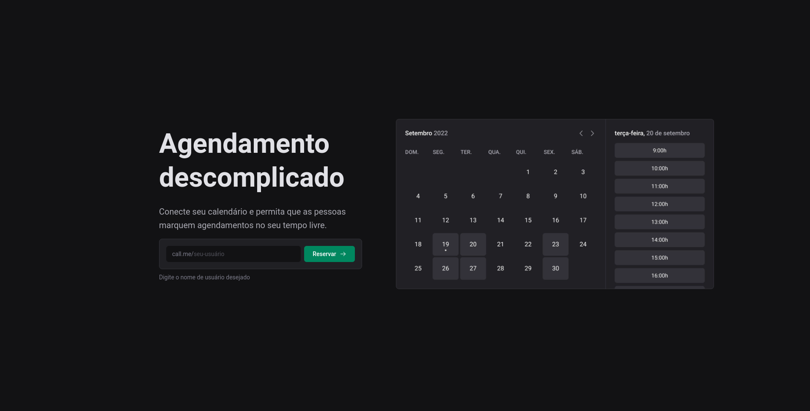

### Call App

Este é um aplicativo de agendamento de reuniões que utiliza tecnologias web modernas, integração com a API do Google Agenda e um calendário com os dias e horários disponíveis do usuário, assim encontrando um melhor horário com a rotina. O aplicativo utiliza o OAuth 2.0 para autenticação do usuário e biblioteca dayjs para manipulação de datas e horas.

This is a meeting scheduling application that uses modern web technologies, integration with the Google Calendar API and a calendar with the user's available days and times, thus finding a better time with the routine. The application uses OAuth 2.0 for user authentication and dayjs library for handling dates and times.

## 🛠 Technologies

- React
- TypeScript
- Next.js
- oAuth 2.0
- Stitches CSS
- Axios
- Design System
- Google API

## 🧑‍💻 Applications

- Next Auth
- SSG and SSR
- Next Routes
- API with next.js

## 🪄 How to use?

### Abra o terminal e copie este repositório em alguma pasta com o comando | Open terminal and copy this repository at some dir with the comand
```
$ git clone https://github.com/lucadboer/call-app.git
```

### Acesse a pasta do projeto no prompt de comando ou pelo mouse | Access dir of the project in cmd or by mouse

```
$ cd call-app
```

### Instale as dependências da aplicação | Install the dependecies of the application

```
$ npm install
or
$ yarn install
```

### Execute a aplicação | Run the application

```
$ npm run dev
or
$ yarn run dev
```

### Depois desses processos acesse http://localhost:3000 no seu navegador. | After this proccess access http://localhost:3000 in your browser

## 💛 Contact

- Email --> luca.boer@outlook.com
- Linkedin --> https://www.linkedin.com/in/luca-destefano-boer/
- Portfolio --> https://about-luca.vercel.app/
